# PIISW, W-4, IO, 2021/2022, semestr letni

## Lista zadań nr 1: HTML i CSS

1. (5 pkt) Utwórz dokument `HTML 5` wraz z arkuszem styli zawierającym wszystkie z następujących 
elementów semantycznych: `article`, `section`, `p`, `h1`, `h2`, `h3` (wypełnij paragrafy treścią, np. lorem ipsum), 
który spełnia następujące warunki: \
    (a) krój pisma dla całej strony powinien być bezszeryfowy, \
    (b) maksymalna szerokość tekstu dokumentu powinna wynosić 1024 piksele, \
    (c) w przypadku monitorów o większej szerokości biały obszar z tekstem powinien wyświetlać się na środku ekranu, 
    po bokach powinny pojawić się jasnoszare marginesy
    o równej szerokości, \
    (d) odstępy między paragrafami powinny wynosić `2em`, \
    (e) odstępy między rozdziałami powinny wynosić `3em`, \
    (f) boczne marginesy tekstu powinny wynosić `3em`, \
    (g) górny i dolny margines tekstu powinien wynosić `2em`, \
    (h) zadbaj, aby elementy `h1`, `h2` i `h3` różniły się wielkością zgodnie z semantyką, \
    (i) dla wszystkich elementów występujących na stronie ustaw właściwość `box-sizing` na `border-box`.
    
    Elementy HTML muszą być użyte zgodnie z ich semantyką.
    
    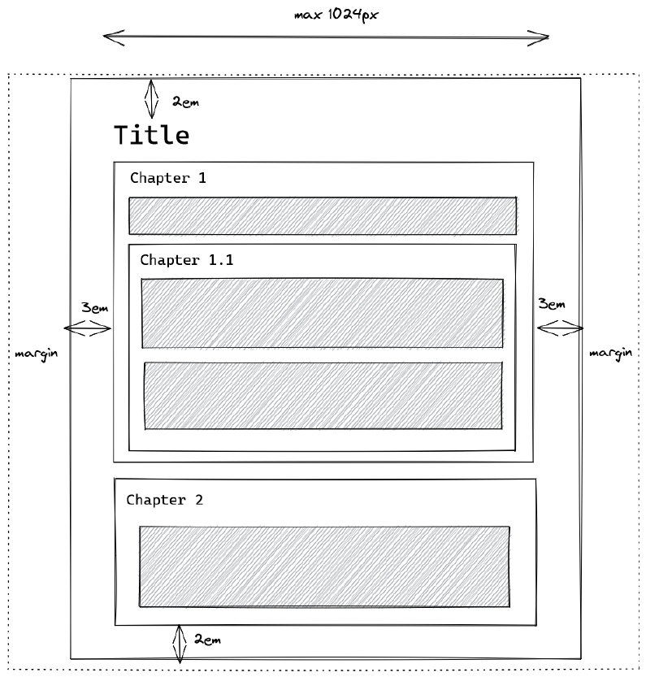

2. (7 pkt) Utwórz dokument HTML 5 wraz z arkuszem styli, który składa się ze znajdującego
   się zawsze na górze strony elementu tytułowego, ze spisu treści znajdującego się po lewej
   stronie oraz z zawartości (lorem ipsum) zajmującej zawsze całą pozostałą część ekranu. \
   Następujące warunki muszą być spełnione: \
   (a) obszar artykułu powinien się automatycznie dostosowywać do przeskalowywanego
   okna przeglądarki tak, aby zajmować całe dostępne miejsce, \
   (b) pionowy pasek przewijania powinien pojawić jedynie, gdy zawartość artykułu nie
   mieści się w obszarze, \
   (c) pionowy pasek przewijania powinien przesuwać jedynie zawartość artykułu, a nie
   całą stronę, \
   (d) pionowy pasek przewijania całej strony nigdy nie powinien być widoczny, \
   (e) wymiary pokazane na rysunku 2 muszą być zachowane, \
   (f) minimalna szerokość okna przeglądarki powinna wynosić `240px` (poniżej tej wartości
   powinien pojawić się pasek przewijania poziomego okna przeglądarki).

    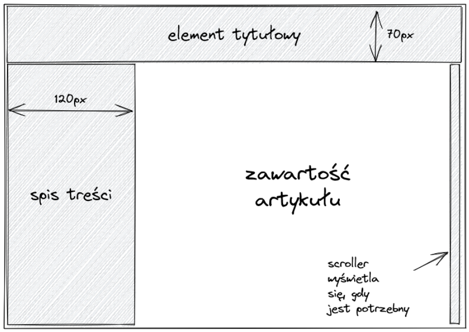

3. (6 pkt) Utwórz dokument zawierający panel trzech przycisków: `Go back`, `Save`, `Delete`
   (elementy typu button). Każdy przycisk powinien składać się z odpowiedniej ikony
   oraz etykiety. Należy usunąć wszelkie natywne style, jakie przeglądarka (Chrome) nakłada
   domyślnie na elementy button. \
   Najlepiej użyć ikon pochodzących z biblioteki `Font Awesome` lub `Line Awesome` - odpowiednią 
   bibliotekę proszę ściągnąć, rozpakować i umieścić w repozytorium. \
   Dodatkowo muszą być spełnione następujące warunki: \
   (a) przyciski muszą mieć ustaloną, jednakową szerokość; \
   (b) przyciski muszą być umieszczone w kontenerze, który zapewnia automatyczne ich
   rozmieszczenie w dwóch lub trzech wierszach, gdy brakuje miejsca; \
   (c) przyciski powinny zajmować miejsce począwszy od lewej strony, z odstępem `10px`
   między nimi; \
   (d) ramka przycisku powinna być niebieskawa, rogi powinny być zaokrąglone; \
   (e) po najechaniu na przycisk kursorem myszy, kształt kursora powinien się zmienić,
   zmianie powinien ulegać też kolor etykiety i ikony, nie powinno zmieniać się za to
   obramowanie; \
   (f) przycisk wybrany np. poprzez klawisz `TAB` powinien być zaznaczony cieniem.
    
    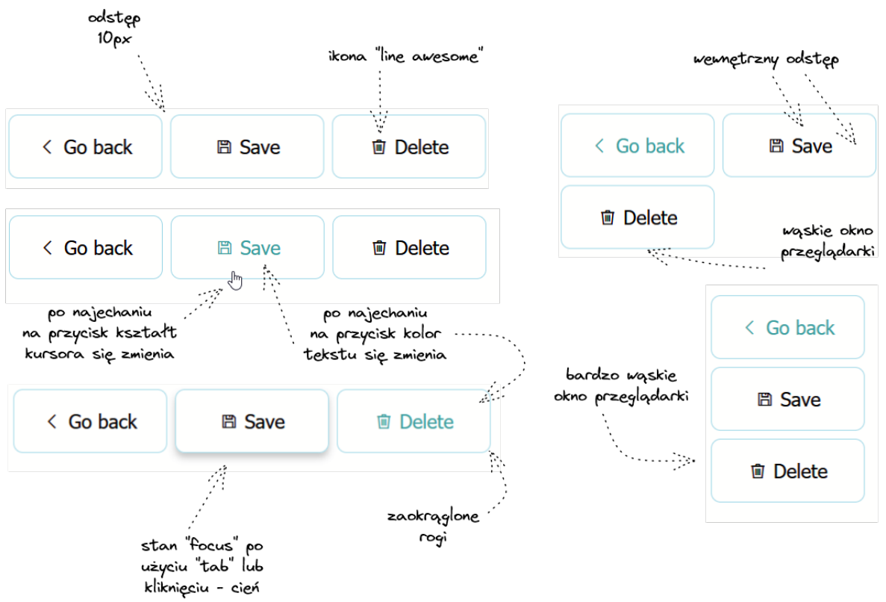

## Lista zadań nr 2: JavaScript

1. (5 pkt) Obsługa zdarzeń modelu DOM. \
   Utwórz dokument `HTML` z osadzonymi stylami oraz z osadzonym kodem `JavaScript`,
   który wyświetli dwa elementy: kontrolkę suwaka oraz koło. \
   (a) Przyjmij zakres dopuszczalnych wartości suwaka jako 10 − 500. \
   (b) Średnica koła powinna być zawsze równa wartości ustawionej na suwaku (w pikselach). \
   (c) Średnica koła powinna zmieniać się dynamicznie podczas przesuwania suwaka. \
   (d) Wewnątrz koła, w jego geometrycznym środku powinna być zawsze wyświetlana jego średnica.

    Przykład wyglądu strony dla dwóch wybranych pozycji suwaka przedstawiono na rysunku. \
    Podpowiedź: koło można wyświetlić korzystając z odpowiednio ostylowanego elementu `div`.

    

2. (6 pkt) Formularze i walidacja. \
   W celu realizacji tego zadania użyj biblioteki styli Bootstrap:https://getbootstrap.com/. 
   Użyj pliku `bootstrap.min.css` zawartego w dystrybucji i zintegruj go z plikiem
   `index.html` będącym rozwiązaniem tego zadania. \
   Zrealizuj formularz pozwalający na wprowadzenie: nazwy, szerokości, wysokości i głębokości
   paczek. Wszelkie wymiary podawane są w centymetrach. \
   Po zatwierdzeniu, nazwa oraz wymiary, a także wyliczona objętość paczki powinna zostać
   dodana jako kolejny wiersz w tabeli znajdującej się poniżej formularza. Ponadto, w stopce
   tabeli powinna być wyliczona sumaryczna objętość wszystkich paczek. \
   Wygląd aplikacji powinien być zbliżony do tego z rysunku. Użyj odpowiednich styli
   z pakietu Bootstrap, aby to osiągnąć. \
   Spełnij poniższe wymagania: \
   (a) Wszystkie pola formularza są obowiązkowe. \
   (b) Pole nazwa powinno być polem tekstowym o maksymalnej długości 20 znaków, pola 
   wymiarów powinny być polami numerycznymi akceptującymi wartości całkowite
   z przedziału od 1 do 1000 cm. \
   (c) Naciśnięcie przycisku `Confirm` powinno przede wszystkim zainicjować walidację pól
   i wyświetlić odpowiednie komunikaty o błędach. \
   (d) Naciśnięcie przycisku `Clear` powinno wyczyścić zawartość formularza. \
   (e) Wyliczana wartość objętości powinna być zaprezentowana w metrach sześciennych
   oraz zaokrąglona do dwóch miejsc po przecinku. \
   (f) Użyj elementów semantycznych takich jak `form`, `table`, `input`, `label` oraz typów
   wejść jak `number`, `submit` oraz `reset`. \
   Wskazówka: pakiet Bootstrap posiada wsparcie dla walidacji (patrz rysunek) - pod
   warunkiem wykorzystywania możliwości, jakie daje `HTML5` w tym zakresie.

   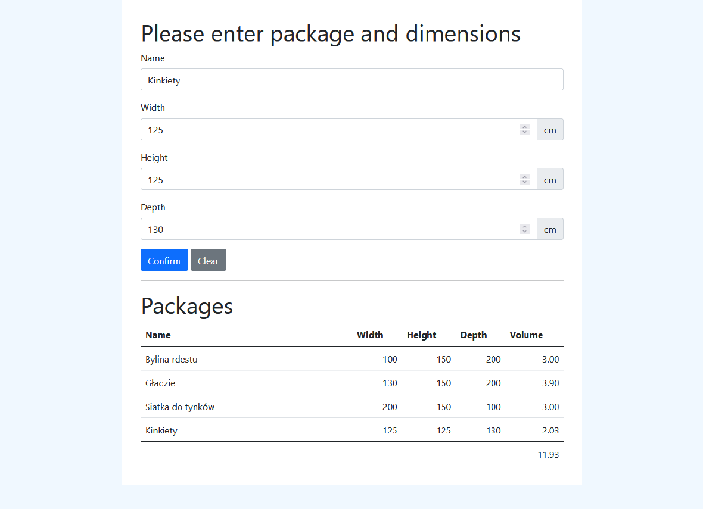
   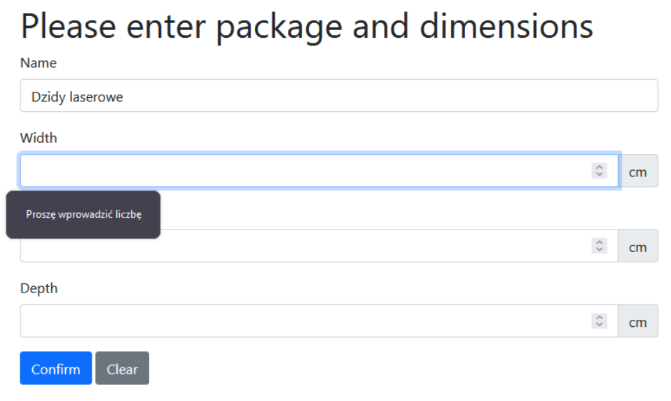

3. (7 pkt) Notatnik i składowanie danych Napisz prostą aplikację notatnika (widoczną na
   rysunku). Aplikacja powinna posiadać następujące funkcje: \
   (a) Tworzenie nowej notatki składającej się z tytułu i treści. Tytuł jest obowiązkowy. Po
   kliknięciu przycisku `Save` notatka powinna zostać dodana do listy po lewej stronie a formularz powinien zostać wyczyszczony. \
   (b) Wybór i edycja zapisanej notatki. Po kliknięciu na jedną z notatek na liście, za-
   wartość notatki powinna wyświetlić się w formularzu. Możliwa jest edycja zarówno
   tytułu jak i treści - po kliknięciu `Save` notatka powinna być zaktualizowana, pola
   formularza powinny zostać wyczyszczone, nowy tytuł notatki powinien zostać od-
   zwierciedlony na liście notatek. \
   (c) Notatki powinny zapisywać się w pamięci `localStorage` przeglądarki - po wciśnięciu
   CTRL-F5 i przeładowaniu strony, notatki powinny wciąż być widoczne.
   Przy ocenie tego zadania będziemy zwracać uwagę na styl:

   - Należy zadbać o możliwie dobrą separację logiki aplikacji i warstwy wizualnej.
   - Użyj obiektowości języka JavaScript tam, gdzie jest to potrzebne i uzasadnione.
   - Odseparuj stan lokalny aplikacji (lista notatek) oraz mechanizm utrwalania (localStorage) - 
    niech twoim jedynym modelem nie będzie wartość z localStorage!
   - Zwróć uwagę, że tytuł notatki nie musi być unikalny - zaproponuj sposób jedno-
    znacznej identyfikacji notatki.

    Zwróć uwagę na subtelną różnicę stanu aplikacji: aplikacja bezpośrednio po uruchomieniu
    prezentuje pusty formularz, który po zapisaniu zawsze skutkuje utworzeniem nowej notatki. 
    Gdy jednak notatkę wybierzemy z listy, zapis skutkuje aktualizacją już istniejącej
    notatki. Zwróć uwagę także, że po naciśnięciu przycisku `Save` stan formularza powinien
    być identyczny jak po uruchomieniu aplikacji - pola są wyczyszczone a formularz jest
    w trybie wprowadzania _nowej_ notatki. \
    Nie wolno używać dodatkowych bibliotek takich jak jQuery, Angular, React, itp. Wolno
    natomiast użyć Bootstrapa do stylowania widoku aplikacji.

    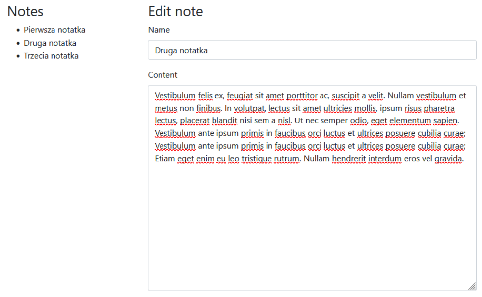

## Lista zadań nr 3: Tworzenie i testowanie backendu: serwisy RESTowe

### Wprowadzenie
W bardzo popularnej dziś architekturze mikroserwisowej, jednym ze stosowanych wzorców jest
Command Query Responsible Segregation (CQRS). Umożliwia on oddzielenie części logiki od-
powiedzialnej za utrzymanie danych (Create, Update, Delete) od ich odczytu (Read). Serwis
związany z odczytem może wówczas stosować inny sposób przechowywania danych (joiny nie
są efektywne), aniżeli relacyjny, który z kolei dobrze odgrywa swoją rolę przy serwisie transak-
cyjnym (tutaj od utrzymania danych).

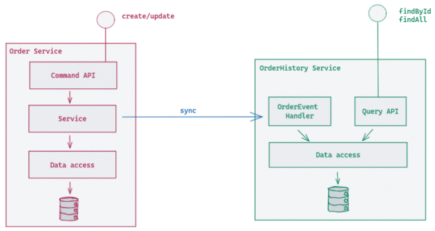 \

1. (6 pkt) `Order` Service \
   Utwórz aplikację Order, która spełni następujące kryteria: \
   (a) będzie oparta na [Spring Boot](https://start.spring.io), \
   (b) zbudowana za pomocą `Maven`, \
   (c) wykorzysta bazę danych `H2`, \
   (d) dane z bazy danych będą dostępne pod adresem host:port/h2-console, \
   (e) wystawi REST API do tworzenia obiektu typu Order, \
   (f) wystawi REST API do aktualizacji statusu dostawy (Created, PickedUp, Delivered)
   dla danego Order, \
   (g) definicja REST będzie możliwa do wyświetlenia z poziomu przeglądarki za pomocą
   host:port/swagger-ui/index.html, \
   (h) encjaOrderpowinna zawierać informacje o kliencie, zamówionych produktach oraz
   dostawie (patrz rysunek), \
   (i) ma odpowiednie pakiety wewnątrz warstwy: REST API, serwisową, dostępu do bazy
   danych.

    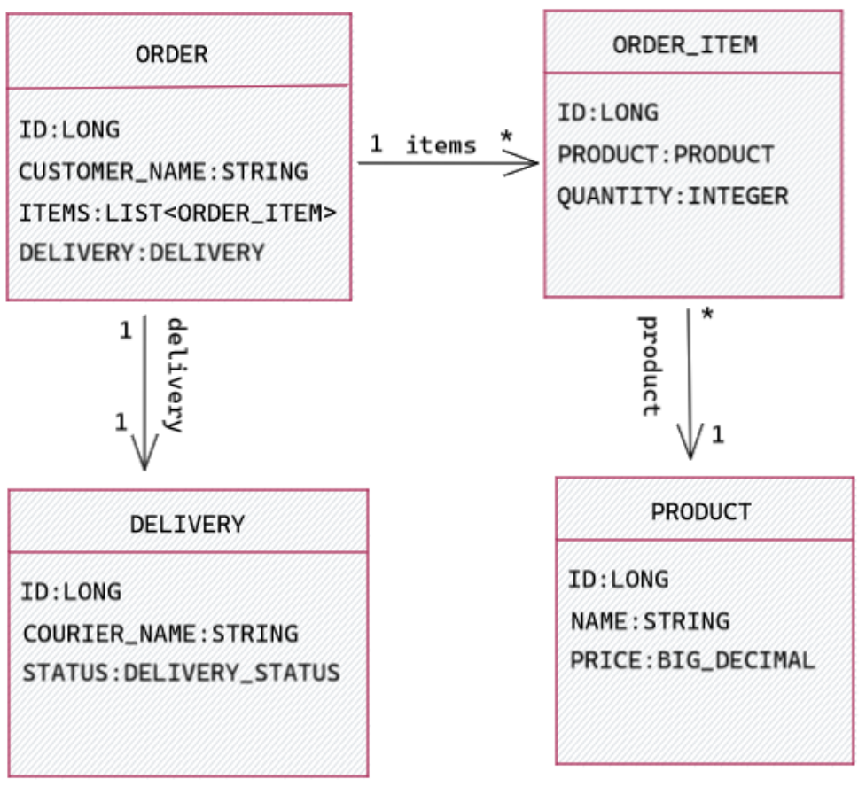

2. (5 pkt) `OrderHistory` Service. \
   Utwórz aplikację OrderHistory, która spełni następujące kryteria: \
   (a) będzie oparta naSpring Boot(https://start.spring.io), \
   (b) zbudowana za pomocąMaven, \
   (c) wykorzysta bazę danychH2, \
   (d) dane z bazy danych będą dostępne pod adresem host:port/h2-console, \
   (e) encjaOrderHistorypowinna zawierać informacje o kliencie, dostawie oraz zamówionych 
   produktach (nazwy po przecinku w jednym polu) wraz z sumaryczną wartością
   zamówienia (patrz rysunek), \
   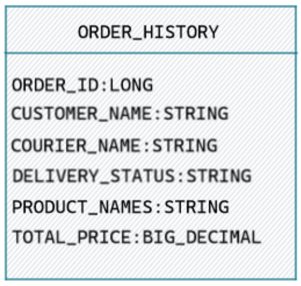 \
   (f) ma oddzielone pakiety: REST API, serwisową, dostępu do bazy danych, \
   (g) wystawi REST API do tworzenia obiektu typuOrderHistory, aktualizacji jego statusu 
   dostawy oraz odczytu danych tego typu (GET - na podstawie id oraz wszystkich
   zapisanych), \
   (h) definicja REST będzie możliwa do wyświetlenia za pomocą host:port/swagger-ui/index.html, \
   (i) strona swagger-ui/index.html grupuje operacje (metody do odczytu oddzielnie od
   tych do tworzenia, patrz rysunki), \
   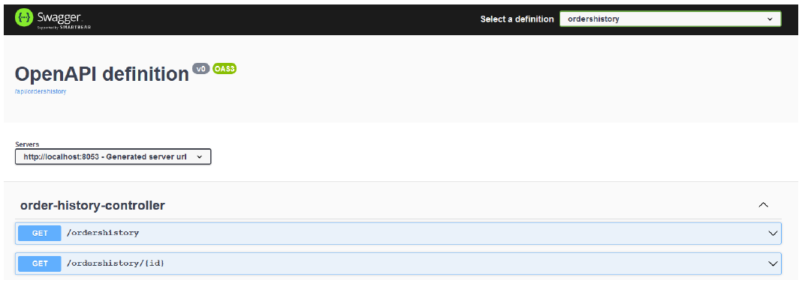 \
   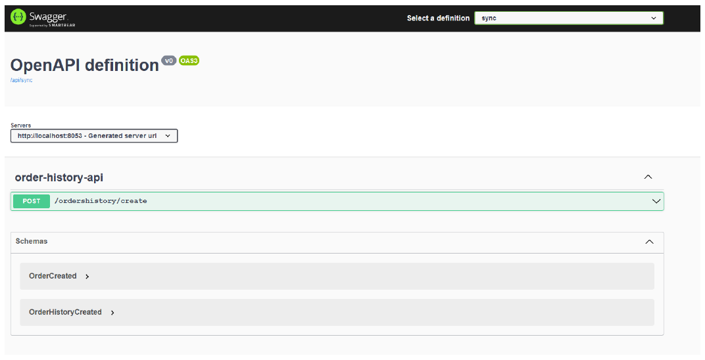 \
   (j) logika zawarta w serwisie jest pokryta testami jednostkowymi (JUnit,Mockito).

3. (3 pkt) Synchronizacja danych pomiędzy Order Service a OrderHistory Service. \
   Zarówno po utworzeniu obiektu typu Order jak i zmianie statusu jego dostawy przez
   Order Service, dane w OrderHistory Service powinny zostać wzbogacone o te zmiany
   (synchronizacja). Do tego celu użyj REST API udostępnionego przez OrderHistory Service.

4. (4 pkt) Open API. \
   Aplikacja OrderHistory Service powinna udostępniać plik Open API (.json lub .yaml),
   który posłuży Order Service do wygenerowania kodu potrzebnego do połączenia poprzez
   REST API z OrderHistory Service.

   **Wskazówka:** Zacznij od wygenerowania pliku z definicją Open API (https://springdoc.org/). 
   Następnie odpowiednio skorzystaj z mavenowego pluginu:openapi-generator-maven-plugin. 
   Wygenerowany kod powinien znaleść się w katalogu target.

5. (2 pkt) RESTful API i paginacja. \
   Rozszerz działanie REST API w OrderHistory Service o metodę wyszukującą zamówienia
   wraz z możliwością pagingu.

   **Wskazówka:** Skorzystaj ze Spring HATEOAS.

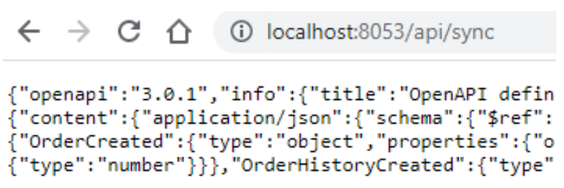
